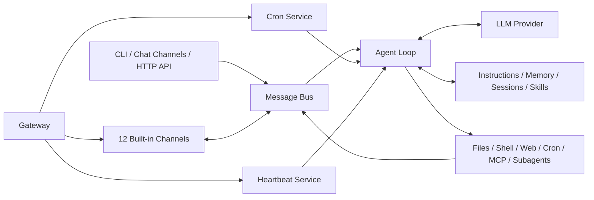

<p align="center">
  
</p>

<h1 align="center">PAssistant</h1>
<p align="center">
  把模型、工具、记忆与常用 App 连接起来，构建长期在线的个人 AI 助手。
</p>

<p align="center">
  
  
  
</p>

<p align="center">
  <a href="#快速开始">快速开始</a> ·
  <a href="#功能一览">功能一览</a> ·
  <a href="#消息渠道">消息渠道</a> ·
  <a href="#配置">配置</a>
</p>

## 它解决什么问题

很多 AI 助手只存在于一次性的聊天窗口中：它不知道你的工作目录，无法持续记住偏好，也不能在定时任务触发后主动回到原来的消息渠道。

PAssistant 将这些能力组织成一个轻量级 Agent 运行时。它既可以在终端中直接使用，也可以作为网关长期运行，将同一个 Agent 接入 Telegram、飞书、Slack、微信等渠道。每个工作空间都可以拥有独立的指令、人格、用户资料、长期记忆、Skills、会话与定时任务。

## 功能一览

| | 能力 | 说明 |
| --- | --- | --- |
| 💬 | **多端对话** | 同时支持 CLI、OpenAI 兼容 API 与 12 个内置消息渠道。 |
| 🧠 | **长期记忆** | 自动将历史对话整理为长期事实与可检索日志，并按会话持续保存上下文。 |
| 🛠️ | **内置工具** | 提供文件读写、Shell、网页搜索与抓取、消息发送、Cron 和子 Agent。 |
| 🧩 | **Skills 与 MCP** | 支持内置 / 工作空间 Skills，也可连接 stdio、SSE、Streamable HTTP MCP Server。 |
| ⏰ | **主动任务** | Cron 负责精确定时提醒，Heartbeat 周期检查工作空间中的长期任务。 |
| 🤖 | **多模型路由** | 支持 Anthropic、OpenAI、OpenAI Codex、GitHub Copilot、国内模型平台与本地模型。 |
| 🧵 | **流式与并发** | 支持流式回复、工具进度提示、会话隔离、后台子 Agent 与任务取消。 |
| 🔌 | **渠道插件** | 内置渠道自动发现，也可通过 Python entry point 安装外部渠道插件。 |

## 工作方式



所有运行时资料默认位于 `~/.passistant/`。模型请求是否离开本机取决于所配置的 Provider；使用 Ollama、vLLM 或 OpenVINO Model Server 时可以连接本地推理服务。

## 快速开始

前提：Python `>= 3.11`。

```bash
git clone https://github.com/Yi-Eaaa/PAssistant.git
cd PAssistant

python3 -m venv .venv
source .venv/bin/activate
python -m pip install -e .

passistant onboard
passistant agent
```

查看当前配置、模型和渠道状态：

```bash
passistant status
passistant channels status
```

## 模型与 Provider

PAssistant 会根据模型名前缀、API Key 与 API Base 自动匹配 Provider，也可以在配置中显式指定 `provider`。

| 类型 | 已支持的 Provider |
| --- | --- |
| 原生 / OAuth | Anthropic、Azure OpenAI、OpenAI Codex、GitHub Copilot |
| OpenAI 兼容 | OpenAI、OpenRouter、DeepSeek、Gemini、智谱、通义千问、Moonshot、MiniMax、Mistral、Step Fun、Groq |
| 本地与自定义 | Ollama、vLLM、OpenVINO Model Server、自定义 OpenAI 兼容端点 |

API Key Provider 可通过 `passistant onboard --wizard` 配置。OAuth Provider 使用独立登录命令：

```bash
passistant provider login openai-codex
passistant provider login github-copilot
```

## 消息渠道

| 渠道 | 接入方式 | 备注 |
| --- | --- | --- |
| Telegram | Bot Token / Long Polling | 支持流式编辑、群聊提及策略与用户白名单。 |
| Discord | Bot Token | 通过可选依赖安装。 |
| Slack | Bot Token + App Token | 使用 Socket Mode，无需公开 Webhook。 |
| WhatsApp | QR 登录 + Node.js Bridge | 使用 Baileys，首次登录需要 Node.js `>= 18`。 |
| 飞书 | App ID + App Secret | 使用 WebSocket 接收事件，无需公网地址。 |
| 钉钉 | Client ID + Client Secret | 支持文本、Markdown 与媒体消息。 |
| QQ | App ID + Secret | 基于 QQ Bot 接入。 |
| 企业微信 | Bot ID + Secret | 使用 WebSocket 接入，通过可选依赖安装。 |
| 微信 | QR 登录或 Token | 个人微信 Long Polling，通过可选依赖安装。 |
| Mochat | Claw Token | 支持私聊、群聊与提及策略。 |
| Matrix | Homeserver + Access Token | 支持端到端加密，通过可选依赖安装。 |
| Email | IMAP + SMTP | 支持邮件轮询、白名单与自动回复。 |


微信或 WhatsApp 可以通过二维码完成首次登录：

```bash
passistant channels login weixin
passistant channels login whatsapp
```

配置好渠道后启动长期运行的网关：

```bash
passistant gateway
```

## 工作空间、记忆与 Skills

首次执行 `onboard`、`agent`、`gateway` 或 `serve` 时，PAssistant 会在工作空间中补齐缺失的模板，不会覆盖已经编辑的文件。

```text
~/.passistant/
├── config.json                 全局配置
├── history/cli_history         CLI 输入历史
├── media/                      渠道媒体文件
└── workspace/
    ├── AGENTS.md               Agent 行为与工作规则
    ├── SOUL.md                 人格、价值与沟通风格
    ├── USER.md                 用户资料与偏好
    ├── TOOLS.md                工具使用约束
    ├── HEARTBEAT.md            周期检查任务
    ├── memory/
    │   ├── MEMORY.md           长期事实
    │   └── HISTORY.md          可检索历史日志
    ├── skills/                 工作空间自定义 Skills
    ├── sessions/               按会话保存的 JSONL 历史
    └── cron/jobs.json          工作空间定时任务
```

PAssistant 自带 GitHub、天气、网页 / 文件摘要、tmux、Cron、Memory、ClawHub 与 Skill Creator 等 Skills。工作空间中的同名 Skill 优先于内置 Skill，因此可以按项目定制 Agent 的工作方法。

## 配置

默认配置文件是 `~/.passistant/config.json`。字段同时接受 camelCase 与 snake_case，保存时使用 camelCase。

下面是一份最小化的 Anthropic 配置示意：

```json
{
  "agents": {
    "defaults": {
      "workspace": "~/.passistant/workspace",
      "model": "anthropic/claude-opus-4-5",
      "provider": "auto",
      "timezone": "Asia/Shanghai"
    }
  },
  "providers": {
    "anthropic": {
      "apiKey": "YOUR_API_KEY"
    }
  },
  "tools": {
    "restrictToWorkspace": true
  }
}
```

常用配置区域：

| 路径 | 用途 |
| --- | --- |
| `agents.defaults` | 模型、工作空间、上下文窗口、最大工具轮次、时区与重试策略 |
| `providers` | 各 Provider 的 API Key、API Base 与自定义 Header |
| `channels` | 渠道凭据、白名单、群聊策略、流式输出与发送重试 |
| `tools.web` | 搜索 Provider、API Key、结果数与代理 |
| `tools.exec` | Shell 工具开关、超时与附加 PATH |
| `tools.mcpServers` | stdio、SSE、Streamable HTTP MCP Server 及工具白名单 |
| `gateway.heartbeat` | Heartbeat 开关、检查间隔与保留上下文数量 |
| `api` | OpenAI 兼容服务的监听地址、端口与请求超时 |

如需运行多个相互隔离的实例，可以为命令传入独立配置和工作空间：

```bash
passistant gateway --config ~/.passistant/work.json --workspace ~/agents/work
```

## 安全说明

- `tools.restrictToWorkspace` 默认为 `false`。在不可信模型或共享环境中，建议设为 `true`。
- Shell 工具会拦截常见的递归删除、磁盘格式化、关机等危险命令，但这不是完整的系统沙箱。
- 为 Telegram、Email 等渠道配置 `allowFrom`，并为群聊选择合适的提及策略。
- API 默认仅监听 `127.0.0.1`；如需跨设备访问，请在可信网络边界后增加鉴权和反向代理。
- 不要将 API Key、Bot Token、OAuth Token 或渠道登录状态提交到 Git。

## 项目结构

```text
├── passistant/
│   ├── agent/                  Agent Loop、上下文、记忆、Skills、Hooks 与子 Agent
│   │   └── tools/              文件、Shell、Web、Cron、消息、MCP 等工具
│   ├── api/                    OpenAI 兼容 HTTP API
│   ├── bus/                    入站 / 出站消息总线
│   ├── channels/               12 个内置渠道与插件发现
│   ├── cli/                    Typer CLI、交互终端与 Onboarding
│   ├── config/                 Pydantic 配置、迁移与运行路径
│   ├── cron/                   定时任务持久化与调度
│   ├── heartbeat/              周期任务检查与通知
│   ├── providers/              模型 Provider 与响应格式转换
│   ├── session/                JSONL 会话存储
│   ├── skills/                 内置 Skills
│   └── templates/              工作空间初始化模板
├── bridge/                     WhatsApp Node.js / Baileys Bridge
├── tests/                      Agent、Provider、渠道、工具、配置与 API 测试
└── pyproject.toml              包元数据、依赖与工具配置
```

## 联系方式

- Email：[iyhong@foxmail.com](mailto:iyhong@foxmail.com)
- 微信：`Yi_Eaaa`

## License

本项目基于 [MIT License](LICENSE) 开源。

Copyright © 2026 Yi Hong

---

<p align="center">
  <strong>PAssistant</strong><br>
  让 Agent 不止回答一次，而是进入你的日常工作流。
</p>
